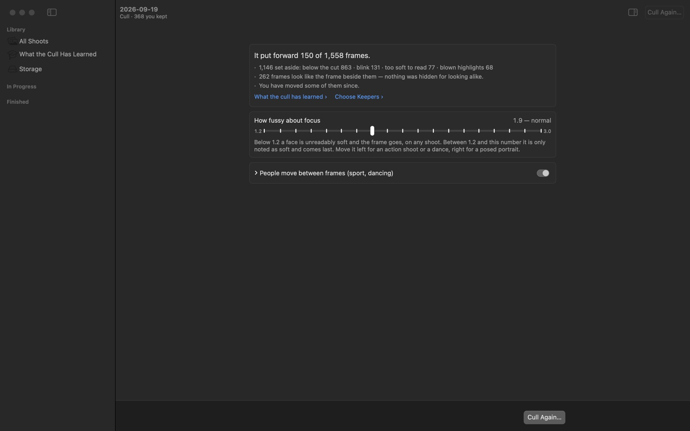
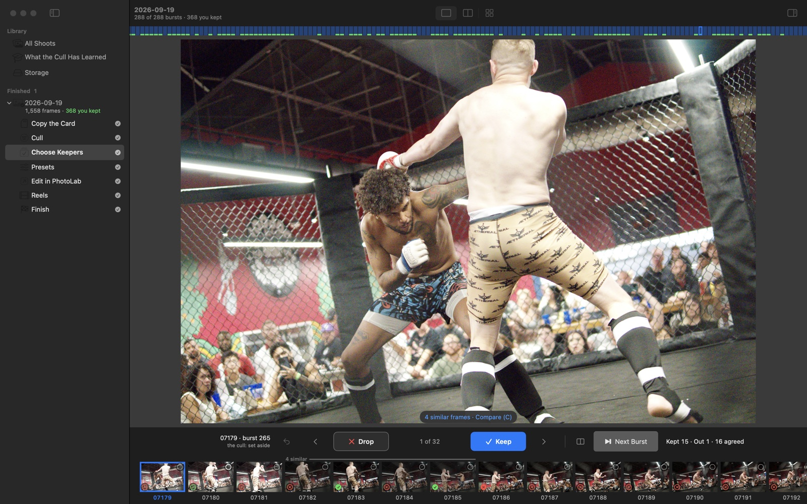

# FirstEdit

A card of RAW files in, a folder of keepers with a starting edit out, on a Mac.

FirstEdit culls a shoot for you (blinks, blur and mouths caught mid-word go;
near-identical frames are grouped, never hidden), lets you choose your keepers
a burst at a time from the keyboard, and then writes a DxO PhotoLab sidecar for
every keeper with a starting edit decided for that frame: exposure, tone curve,
white balance and color. You open the folder in PhotoLab and finish from there.
Noise reduction stays with PhotoLab (DeepPRIME).

It is MIT. `pipeline/` is the engine and runs on its own; `app/` builds it into
the Mac app. It has been measured on four of my own shoots so far. If it gets
your camera, editor or kind of shoot wrong, an issue with the frame and the
numbers is the most useful thing you can send.



## Install

Download the `.dmg` from the
[releases page](https://github.com/nickcupo/first-edit/releases) and drag
FirstEdit into Applications. Apple silicon, macOS 15 or newer. The first launch
fetches one picture model (1.7 GB); everything else is inside the app.

## How a shoot goes

1. **Copy the card.** Every byte is read back to check it.
2. **Cull.** Every face is judged at full resolution; broken frames are set
   aside with a reason, and the rest are ranked a burst at a time.
3. **Choose keepers.** One burst on screen: `E` keep, `D` drop, `S`/`F` previous
   and next frame, `R`/`W` next and previous burst, `C` compare near-identical
   frames, `Q` undo.
4. **Presets.** A sidecar is written beside each keeper's RAW.
5. **Edit in PhotoLab.** Your keepers open in one folder with their sidecars.
6. **Instagram and Finish.** Crops for Instagram, and what you exported is
   written down so the next shoot learns from it.



## The starting edit

Each keeper is measured on the camera's JPEG and on the RAW itself, and gets
its own values:

- **Exposure.** The frame's midtones or its main face are brought toward a
  target brightness, never past the highlights the RAW can hold, the noise its
  ISO allows, or a stop and a half. Frames with clipped highlights use
  PhotoLab's own highlight recovery. A face still too dark gets a gentle mask.
- **Tone curve.** A gentle S-curve per frame.
- **White balance.** As shot, or PhotoLab's fluorescent preset where your own
  edits show you would switch.
- **Color.** More Vibrancy on flat frames and none on vivid ones, skies and
  foliage nudged toward their preferred colors, skin held under a published
  limit.

The brightness, face and contrast targets are learned from your own finished
exports, one prediction per frame, once a model beats the built-in rules on
shoots it has not seen. Until then published rules decide. Every frame's note
in `cull/presets.md` says what was decided and why.
[docs/COLOR.md](docs/COLOR.md) has the sources for every target.

## From a checkout

```bash
./pl setup                                   # venv and models (Python 3.12, exiftool)
./pl ingest /Volumes/CARD 2026-10-04-lake    # copy a card into ~/photos/shoots/
./pl cull ~/photos/shoots/2026-10-04-lake    # cull it
./pl presets ~/photos/shoots/2026-10-04-lake --dop   # write the sidecars
./pl gather ~/photos/shoots/2026-10-04-lake  # one folder of keepers for PhotoLab
./pl learned run                             # learn from what you have exported
```

Every command takes the shoot folder, its `raw/` or its `cull/`. Shoots live
under `~/photos/shoots/<date-name>/`: RAWs in `raw/`, your decisions in
`decisions/`, rebuildable work in `cull/`, keepers for PhotoLab in `edit/`.

## More

- [docs/GUIDE.md](docs/GUIDE.md): the long version, with every number and why
- [docs/WORKFLOW.md](docs/WORKFLOW.md): step by step, from card to last photo
- [docs/COLOR.md](docs/COLOR.md): how exposure, tone and color are decided
- [docs/ML.md](docs/ML.md): what is learned, and the checks it has to pass
- [docs/DESIGN.md](docs/DESIGN.md): the app, screen by screen
- [CONTRIBUTING.md](CONTRIBUTING.md): running the checks and building the app
- [RELEASING.md](RELEASING.md) · [TODO.md](TODO.md)

## Licence

MIT. The images in `tests/fixtures/pets` are from the Oxford-IIIT Pet dataset
(CC BY-SA 4.0) and are not covered by it. `NOTICES.md`, generated at every
build and shipped inside the app and beside the DMG, lists every third-party
component and its licence.
