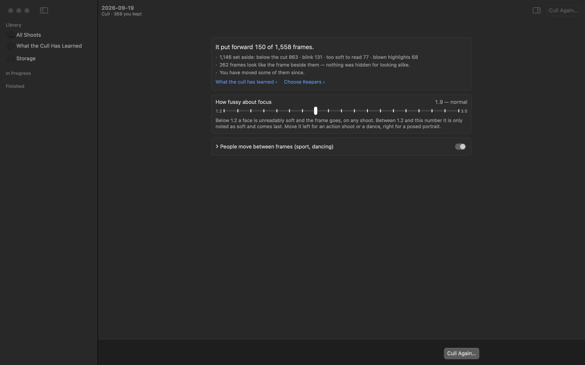
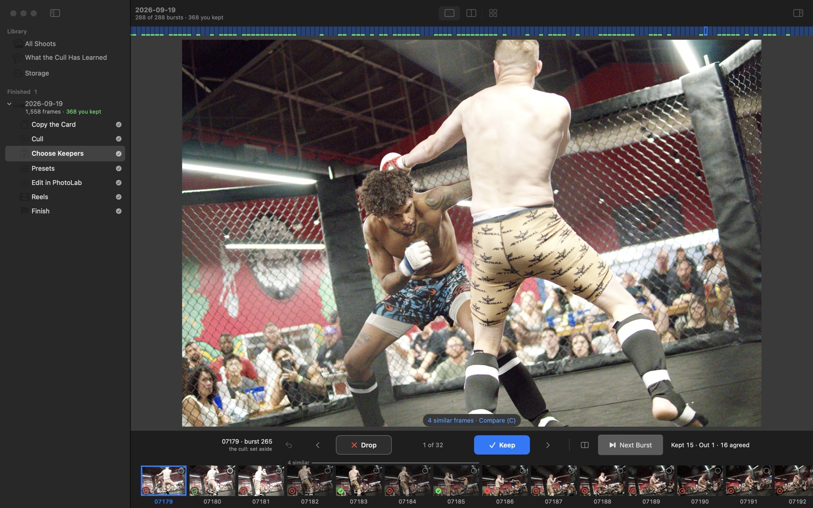
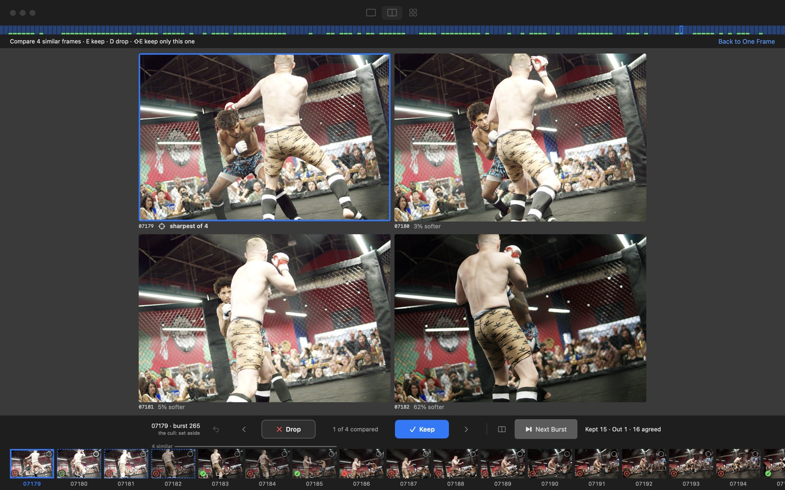

<div align="center">

# FirstEdit

**A card of RAW files in. A folder of keepers with a starting edit out.**

Culling and a per-frame starting edit for DxO PhotoLab, on your Mac.

[](https://github.com/nickcupo/FirstEdit/releases/latest)
[](#install)
[](#from-a-checkout)
[](LICENSE)

[Download](https://github.com/nickcupo/FirstEdit/releases/latest) ·
[Guide](docs/GUIDE.md) ·
[Workflow](docs/WORKFLOW.md) ·
[How the edit is decided](docs/COLOR.md) ·
[Changelog](CHANGELOG.md)



</div>

## What it does

FirstEdit takes a shoot from the card to PhotoLab. It culls the shoot, lets
you pick keepers from the keyboard a burst at a time, and writes a DxO
PhotoLab sidecar for each keeper. You open the folder in PhotoLab and finish
the edit there.

- **Culls for you.** Every face is judged at full resolution. Frames with
  blinks, blur or a mouth caught mid-word are set aside, and each one says
  why. Near-identical frames are grouped, never hidden.
- **Keyboard-first choosing.** One burst on screen at a time, with a
  side-by-side compare for frames that differ by a blink.
- **A starting edit per frame.** Each keeper gets its own exposure, tone
  curve, white balance and color, measured from its RAW. There are no
  presets for a whole shoot.
- **Learns your taste.** Once a model beats the built-in rules on shoots it
  has never seen, the brightness, face and contrast targets are learned from
  your finished exports.
- **Everything is explained.** Each frame's note says what was decided and why.
  Nothing is written that PhotoLab can't open.
- **Packed RAW backups.** Backing up to iCloud packs each burst into one
  lossless `.roll` file at roughly half the size of its RAWs, and every byte
  comes back on the way down.

Noise reduction stays in PhotoLab (DeepPRIME). FirstEdit never renders your
photos itself.

## Screenshots

<table>
  <tr>
    <td width="50%"></td>
    <td width="50%"></td>
  </tr>
  <tr>
    <td align="center"><sub><b>Light table:</b> one frame at comparison size, with the whole burst underneath</sub></td>
    <td align="center"><sub><b>Compare:</b> four near-identical frames, each with its focus score</sub></td>
  </tr>
</table>

## Install

1. Download the `.dmg` from the [latest release](https://github.com/nickcupo/FirstEdit/releases/latest).
2. Drag **FirstEdit** into Applications.
3. On first launch, the app fetches one picture model (1.7 GB). Everything
   else ships inside the app.

Requires a Mac with Apple silicon on macOS 15 or newer, plus DxO PhotoLab to
finish the edit.

## How a shoot goes

| Step | What happens |
|---|---|
| **1. Copy the card** | Every byte is read back after copying to check it. |
| **2. Cull** | Broken frames are set aside with a reason. The rest are ranked a burst at a time. |
| **3. Choose keepers** | `E` keep · `D` drop · `S`/`F` previous/next frame · `R`/`W` next/previous burst · `C` compare · `Q` undo |
| **4. Presets** | A sidecar is written beside each keeper's RAW. |
| **5. Edit in PhotoLab** | Your keepers open in one folder, with their sidecars. |
| **6. Instagram & Finish** | Crops for Instagram. What you exported is recorded so the next shoot learns from it. |

## Packed RAW backups

**Finish ▸ Back Up to iCloud…** sends a shoot's RAWs up *packed* by default.
Choose *RAW files* on the same sheet to send the ARWs as they are.

**How it saves space.** A burst is many near-identical frames. Each burst
becomes one file, `packed/burst-<n>.roll`, holding every frame of that burst,
not just one of them. The frame you kept is stored on its own, compressed.
Each of the others is stored as its difference from the frame next to it,
after allowing for the camera moving a few pixels between shots. A frame that
isn't in any burst gets a file of its own (`frame-<name>.roll`), compressed
the same way. The codec understands Sony's compressed-ARW sensor blocks
(a6500 "Compressed" RAW), which is where most of the saving comes from. The
frame-to-frame differences add the rest.

**It's lossless.** Unpacking gives back the original ARW, byte for byte, with
its modified time. Each file is unpacked and checked against its RAWs'
checksums before it is copied up, and read back after. A frame that doesn't
come back exactly is sent as its ARW instead.

**Estimated savings.**

| | RAWs | Packed (about 55%) | Saved |
|---|---|---|---|
| One a6500 compressed ARW | ~24 MB | ~13 MB | ~11 MB |
| A 1,000-frame shoot | ~24 GB | ~13 GB | ~11 GB |
| A year of 40 such shoots | ~960 GB | ~530 GB | ~430 GB |

Measured on real hand-held bursts, the packed files came to 40–66% of their
RAWs' size, 55% overall, where `xz -9` managed 74%. Frames shot in bright
light at base ISO should pack smaller, and dark, noisy ones larger, because
sensor noise can't be predicted. `./pl burstpack bench <shoot>` measures a
shoot of yours without writing anything.

**Getting them back.** You never have to unpack by hand. Culling again,
writing the presets or building the PhotoLab folder first brings back any RAW
that is only in iCloud, from its ARW or its `.roll`. The viewer shows packed
frames as it shows RAWs, unpacking a burst when one of its frames is opened.
**Bring Back from iCloud…** puts every RAW of a shoot back on the Mac.
In Finder, each `.roll` shows the frame you kept as its icon, and the space
bar previews it, even for files that are only in iCloud.
**Free Up Space ▸ Pack in iCloud** packs RAWs that are already up there as
ARWs, then removes each ARW copy once its packed copy is proven.

How the codec works, with the measurements: [docs/BURSTPACK.md](docs/BURSTPACK.md).

## The starting edit

Each keeper is measured on the camera's JPEG and on the RAW, and gets values
of its own:

| | How it is decided |
|---|---|
| **Exposure** | The midtones, or the main face, move toward a target brightness. The lift never goes past the highlights the RAW can hold, the noise its ISO allows, or 1.5 stops. Frames with clipped highlights use PhotoLab's own highlight recovery. A face that is still too dark gets a gentle mask. |
| **Tone curve** | A gentle S-curve, sized to the frame's light. |
| **White balance** | As shot, or PhotoLab's fluorescent preset where your own edits show you would switch. |
| **Color** | More Vibrancy on flat frames and none on vivid ones. Skies and foliage are nudged toward their preferred colors, and skin stays under a published limit. |

Published rules decide until a model has learned your exports. A learned
model is used only if it beats the rules on held-out shoots, and even then
it can't move a safety limit. Every frame's note in `cull/presets.md` says
which one decided. [docs/COLOR.md](docs/COLOR.md) has the sources for every
target, and [docs/ML.md](docs/ML.md) has the checks a model has to pass.

## From a checkout

The engine in `pipeline/` runs on its own. `app/` builds it into the Mac app.

```bash
./pl setup                                          # venv and models (Python 3.12, exiftool)
./pl ingest /Volumes/CARD 2026-10-04-lake           # copy a card into ~/photos/shoots/
./pl cull ~/photos/shoots/2026-10-04-lake           # cull it
./pl presets ~/photos/shoots/2026-10-04-lake --dop  # write the sidecars
./pl gather ~/photos/shoots/2026-10-04-lake         # one folder of keepers for PhotoLab
./pl learned run                                    # learn from what you have exported
```

Every command takes the shoot folder, its `raw/`, or its `cull/`. Each shoot
lives in `~/photos/shoots/<date-name>/`:

```text
raw/         the RAWs, with a sidecar beside each keeper
decisions/   your keeps, stars and drop reasons
cull/        rebuildable work: reports, previews, presets.md
edit/        the keepers, gathered for PhotoLab
```

## Documentation

| | |
|---|---|
| [Guide](docs/GUIDE.md) | The long version, with every number and the reason for it |
| [Workflow](docs/WORKFLOW.md) | Step by step, from card to last photo |
| [Color](docs/COLOR.md) | How exposure, tone and color are decided, with sources |
| [ML](docs/ML.md) | What is learned, and the checks it has to pass |
| [Design](docs/DESIGN.md) | The app, screen by screen |
| [Burstpack](docs/BURSTPACK.md) | Packed RAW backups: the format, the codec and what it saves |
| [Contributing](CONTRIBUTING.md) | Running the checks and building the app |
| [Releasing](RELEASING.md) | Signing, notarizing and publishing a release |

## Contributing

FirstEdit has been measured on four of my own shoots so far. If it gets your
camera, editor or kind of shoot wrong, please open an issue with the frame and
the numbers from its note. That is the most useful thing you can send. For
security reports, see [SECURITY.md](SECURITY.md).

## Licence

[MIT](LICENSE). The images in `tests/fixtures/pets` come from the Oxford-IIIT
Pet dataset (CC BY-SA 4.0) and are not covered by that licence. `NOTICES.md` is
generated at every build and ships inside the app and beside the DMG. It lists
every third-party component and its licence.
