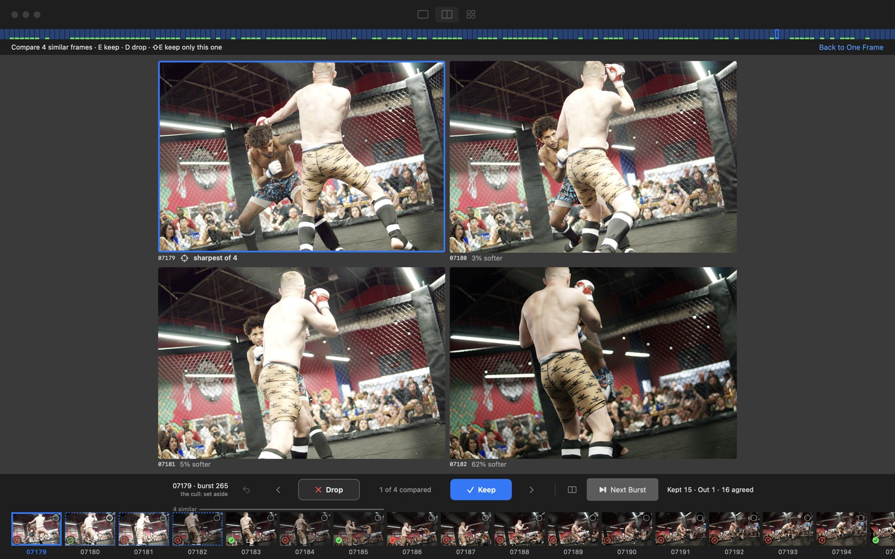

# FirstEdit, in full

The long version of the [README](../README.md): every step, every number, and why.

A card of RAW files in, a folder of keepers with a starting edit out, on a
Mac, without looking at every frame. Every face is judged on the
full-resolution decode; blinks, blur and mouths caught mid-word go; a run of
near-identical frames inside one burst is bracketed as a stack, with the
cull's guess at the top of it and nothing taken off the screen. Then I
choose, a burst at a time, with the keyboard. After that it writes a DxO
PhotoLab sidecar per keeper: exposure decided from what the sensor recorded,
toward where my finished faces sit; a mask on any face the global correction
leaves short; and, for a venue I have exported finished frames from, the look
I gave that venue. Anywhere else it starts from DxO's own camera-body
rendering and invents nothing.

The Mac workflow keeps noise reduction in DxO PhotoLab/DeepPRIME. FirstEdit
writes PhotoLab sidecar adjustments and does not add custom denoising before
PhotoLab.

It is MIT. The engine in `pipeline/` runs from a checkout on its own, and
`app/` builds it into a Mac app, which is the thing I actually use. I would
like it to work on other people's shoots as well as mine. So far it has been measured
on four of my own shoots and nothing else, and the table below says exactly
what that covers. If you have a camera, an editor or a kind of shoot it gets
wrong, an issue with the frame and the numbers is the most useful thing you
can send. [CONTRIBUTING.md](../CONTRIBUTING.md) says how to run the checks and
how the code hangs together, [docs/DESIGN.md](DESIGN.md) is what the app is
and why each part of it is that shape, and [TODO.md](../TODO.md) is what is missing
or wrong — including the fact that nothing the cull has learned on this Mac
since it shipped has yet passed the check that would let it be used.

## Install

Download the FirstEdit `.dmg` from the
[GitHub releases page](https://github.com/nickcupo/FirstEdit/releases),
then drag FirstEdit into Applications. OpenCV is included inside the app;
the separate wheel files are only for building from source. The app requires an Apple silicon Mac running
macOS 15 or newer. Release notes state whether the installer is notarized.

The public app includes card import, culling, keeper review, starting edits and
Instagram cuts. Private extensions and their reel-making engine are not bundled.

## What it looks like

The cull reports what it did in the words a person would use, and never hides a
frame for looking like the one beside it.


Then the light table, a burst at a time, from the keyboard and under one hand,
with the other on the mouse: E keeps, D drops, S and F step back and forward,
R and W go to the next and previous burst, Q undoes and X clears a mark.
Leaving a burst forward, with R or with F or → off its last frame, is what
records it as looked through. K, N, P, U, 0 and the arrows work too. The strip
underneath is every frame of that burst, in shutter order, with the ones that
look alike bracketed rather than removed.


C opens the run of near-identical frames side by side with the focus measurement
under each, which is the decision the cull cannot make for you.



## What it does, measured

Every number here was produced by `./pl bench` or `./pl check` against
choices I made by hand, and reproduced from the files on disk before it was
printed. The frames I kept are the answer key; a frame the cull rejected
that I later kept counts as a loss.

| Shoot | Frames | I kept | Survived the cull | What the losses were |
|---|---|---|---|---|
| Portraits, evening, flash | 198 | 12 | 12 | |
| A lounge, red light | 296 | 25 | 25 | |
| A dog, daylight | 54 | 14 | 14 | |
| An action shoot, indoors, bursts | 1,157 | 154 | 152 | two blinks: eyes shut taking a hit, lids down looking at the floor |

The action shoot's key is the 154 frames I exported after two passes; the
editor's pick and reject flags are written nowhere on disk, so for a
finished shoot the exports are the key. The same shoot under the rules as
they stood a day earlier lost 33 of those 154: a focus floor set on
portraits, a mouth-caught-open rule and a per-burst quota, none of which
holds when set on three shoots and tested on the fourth. They are notes
now, not vetoes.

What the cull cannot do is choose among the survivors. On that shoot
nothing it measures separates the 154 I kept from the 137 I took into the
editor and threw out (the best single signal reads 0.61, the score 0.49),
and those 137 are not the same pictures as the 154. So it throws out what is
broken, brackets the frames that look alike without hiding any of them, and
puts the rest in tiers a burst at a time; the numbers for that are below and
in [docs/ML.md](ML.md).

| Check | Result | What it proves |
|---|---|---|
| `./pl check` | 94 of 94 | the face judge's verdicts on frames settled by eye have not moved |
| `./pl check tests/pets_truth.json` | 24 of 24 | a cat's or dog's face can never veto a frame |
| `./pl selftest` | 9 of 9 | the whole machine runs end to end on six frames, and every flag the engine passes to a script is a flag that script takes |
| Ranking: precision of the cull's own top picks against my keepers | 0.25 / 0.40 / 0.57 / 0.20 on the four shoots, against 0.06 / 0.09 / 0.29 / 0.14 by chance | the score orders frames better than nothing, and reads no taste; on the action shoot 31 of my 154 land in the top 154, against 20 by chance, ranked without the venue's own ranker because that was learned from the same answer key |
| Exposure from the sensor | reproduces the one frame I had finished in a new venue exactly (−0.99 EV chosen, −0.99 EV done, face lands at L* 49.8) | one frame; the calibration behind it is 16 exports |
| White balance, AsShot or Fluo | agrees with my own choice on 192 of 198 frames in the one room it was learned from; leaves AsShot on every frame of a gym, as I did | a warmth preference in one bar, not a rule |

What has not been validated at all, because I have no frames of it: high-key
or low-key styles (both trip an exposure veto by construction), closed-eye
or soft-focus poses (both trip a face veto), pets beyond one 54-frame shoot,
any camera but Sony, and any rendering of DxO's I have not exported and
measured. [docs/ML.md](ML.md) has every number, every threshold and
where it came from, including the things I measured and did not ship.

## How it flows

```
 card
  |   ./pl ingest          copies the card and re-reads every byte
  v
 raw/*.ARW
  |   ./pl cull            decode at full size -> focus on the subject
  |                        -> every face at full resolution -> CLIP
  |                        writes cull/cull.csv, cull/thumbs, cull/decoded,
  |                        cull/picks (hard links)
  v
 survivors, in tiers
  |   the app's light table   I choose, a burst at a time, with the keyboard
  |                        writes decisions/organize.json, labels.json,
  |                        selects.json (the answer key)
  v
 keepers
  |   ./pl presets --dop   reads each setup and each frame, and the RAW
  |                        writes cull/presets/*.preset, cull/presets.md,
  |                        raw/<frame>.ARW.dop
  v
  |   ./pl gather          edit/: the keepers hard-linked beside their sidecars
  v
 PhotoLab  ->  export/
  |   ./pl instagram       Instagram-sized copies of the exports
  |                        writes <shoot>/instagram/
  v
 the app's Finish step    records the keepers and writes down the exports
  |   ./pl taste           relearns from every frame I EXPORTED, never from
  |                        a keeper I did not: the venues, where I put
  |                        faces, what I set the same way there
  v
 the learned folder       a candidate, used only once it passes the keeper check
```

## The app

**FirstEdit** (installed as `FirstEdit.app`) is the whole thing in one window: put the card in,
name the shoot, and it walks the steps — copy the card, cull, choose
keepers, presets, edit in PhotoLab, Instagram, finish (and reels, between
Instagram and finish, in a build that carries a reel maker; the public one
does not). Quit anywhere and it opens again on that shoot and that step.
Choosing keepers is where the hours go, and it is one burst on one screen,
under the left hand: `E` keep, `D` drop, `S` and `F` the previous and next
frame, `R` and `W` the next and previous burst, `Q` undo, `X` clear the
mark, `C` the frames of a stack side by side, `Z` 1:1, `G` every burst, the
space bar the whole frame, `1`–`6` why a frame is out. The keys I learned
first — `K`, `N`, `P`, `U`, `0` and the arrows — still work beside them. A
second display, if there is one, holds the frame you are on at full size
while you work on the first; it can never take the keyboard, so Keep, Drop
and Next Burst never go dead because the picture window has focus.

The Instagram step is one wall of the shoot's exported photographs with
every cut drawn on it, worked out in the background the moment the step
opens: a portrait cut to 3:4 (1080 × 1440) or 4:5 around its subject, a
landscape left whole or cut, and the ones Instagram's profile grid would cut
the subject out of first. It is moved through with Choose Keepers' own keys,
read from the same table — `S` and `F` to move, `E` to include, `D` to leave
out, `X` to clear, the space bar to open the cut and adjust it, `Q` to undo
— and **Make N Copies** writes exactly the cuts shown into
`<shoot>/instagram`: a crop and a resize of the export, with no sharpening
and no tone added.

Installers are available on the [releases page](https://github.com/nickcupo/FirstEdit/releases).
The app checks that page for updates and verifies the signing identity before
installing one. The installed bundle is `FirstEdit.app`; on first launch the
former `Application Support/First Edit` folder is migrated to
`Application Support/FirstEdit` without moving or deleting any photographs.

Apple silicon, macOS 15 or newer: `app/Package.swift` builds for
`.macOS(.v15)` and `app/Resources/Info.plist` promises 15.0. On first launch
it fetches the picture model (CLIP, 1.7 GB, once) with a bar; everything
else is inside the app. Nothing runs when the window is closed: the app
starts the engine as a child process, and quitting it stops the cull too (it
asks first if one is running).

Its files live in `~/Library/Application Support/First Edit/`: the
models, the log, what it has learned (`learned/`), the list of work it has
been given (`queue.json`), and an `extension/` folder (below). Shoots go to
`~/photos/shoots/` as on the command line, a folder of your own can be
chosen in Settings, and every step says which files it wrote and where.

### Coming from Photo Pipeline

FirstEdit is the same app under a new name. Before its first launch, make
a Time Machine backup, and keep `Photo Pipeline.app` somewhere other than
`/Applications` rather than in the Trash: it is how the move is undone.

The first time FirstEdit opens on a Mac that had Photo Pipeline, it renames
`~/Library/Application Support/Photo Pipeline` to `First Edit` in place, so
the 1.7 GB of models and everything learned move without a byte being
copied, and in the same step leaves a link under the old name, so anything
using that path, even at that instant, finds the same folder. It copies
Photo Pipeline's settings across once and never changes the old ones.
`MIGRATED.json` in the folder says what moved and how to put it back: quit
FirstEdit, delete the link, rename the folder back, and open Photo
Pipeline, whose settings were never touched. Two things an undo does not
put back: settings changed in Photo Pipeline after the move are not copied
again if FirstEdit is opened later, and sidecars FirstEdit wrote say
`first-edit sidecar`, which Photo Pipeline does not know as its own, so it
leaves them as they are. A run from a checkout with no `PIPELINE_SUPPORT` looks for
`First Edit` first and `Photo Pipeline` second, so the app and a checkout go
on sharing one folder on either side of the move.

It moves nothing while Photo Pipeline is still open, and says so; if Photo
Pipeline is opened while FirstEdit runs, FirstEdit says that too and
offers to quit it, because the two share one folder. If both folders are
already there it uses FirstEdit's, says where the other one is in Settings
▸ Advanced, and merges and deletes nothing; when FirstEdit's has no models
or nothing learned and the other has, it also says so once, in an alert, with
how to use the other one instead. Shoots stay where they are, and archived
RAWs stay in iCloud Drive under `Photo Pipeline Archive`, which keeps its
name. macOS asks once more for the card and for notifications, because it
keeps those answers per app.

Photo Pipeline's Check for Updates cannot install FirstEdit, because the
bundle identifier changed; the first copy is installed by hand, and
[RELEASING.md](../RELEASING.md) ("Once: from Photo Pipeline to First Edit") has
the order. The engine keeps its own names through the rename — `pipeline/`,
`./pl`, the `PIPELINE_*` variables, `PipelineKit` — and so do the extension
contract and the git config key the vocabulary check reads.

### Stacking up an evening

Every step's button either does the work now or adds it to a list, and it
says which; holding ⌥ always adds. **Up Next** in the Activity window
(⌥⌘L) is that list: what is running, then what is waiting, in an order you
can drag, with hold and remove. It is written to `queue.json`, so a list
filled at midnight is still there in the morning, and every item is built
again from what you asked for in the instant before it starts — so an item
that can no longer run is skipped with the engine's own sentence rather
than failing halfway. Ingest, cull, presets, gather, spread, reel,
instagram, the storage copies and the storage plans can all go on it.
Nothing that removes photographs can: `stor-drop`, `stor-expire` and
`stor-reclaim` are refused by name (`NEVER_QUEUED` in `pipeline/studio.py`),
because each of them runs against a list you read a moment before, and a
confirmation held on a list for an hour is a confirmation of something
nobody measured.

### Building it

`app/build.sh` builds, signs and (optionally) notarizes the app. It needs
full Xcode rather than the command-line tools alone — `swift`, `actool`,
`xcstringstool`, `codesign` — with an SDK of 26 or newer, because the app is
macOS 15 code that reaches a few macOS 26 APIs behind `#available`. It
assembles a relocatable CPython with the requirements, the pipeline, the
small models and exiftool, builds the Swift package, and signs ad hoc; with
`IDENTITY=` set it signs with a Developer ID, and with either
`NOTARY_PROFILE=` (a notarytool keychain profile) or `NOTARY_KEY=`,
`NOTARY_KEY_ID=` and `NOTARY_ISSUER=` (an App Store Connect API key) it
notarizes and staples. The public build is the default; `PRIVATE_BUILD=1` is
the author's own copy, which carries private modules and is never notarized.

Before it signs anything the script writes `NOTICES.md` from the bundle it
has just assembled — every wheel's licence out of its own `dist-info`, the
models out of `pipeline/models.json` — and stops if a dependency will not
say what its licence is. That file is generated at every build and is not in
this repository; the copies that count are the one inside the app and the
one written beside the DMG in `dist/`. The script then refuses to build
while any GPL FFmpeg library is in the bundle; `ALLOW_COPYLEFT=1` builds
anyway, for a local copy you hand to nobody. Nothing trips it, because the
bundle's OpenCV is built from source without FFmpeg by
`app/tools/build-opencv.sh` rather than taken from PyPI.

[RELEASING.md](../RELEASING.md) is the whole procedure for a release, in order.

## From a checkout

The engine runs without the app. `./pl` is the one entry point and prints
its own list of commands:

```bash
./pl ingest /Volumes/CARD 2026-10-04-lake               # copy the card, hashed as it goes (--verify end|none)
./pl cull ~/photos/shoots/2026-10-04-lake/raw --copy     # decide what is worth keeping
./pl presets ~/photos/shoots/2026-10-04-lake/raw --install --dop --picks-only   # after you have chosen: edit-ready sidecars
./pl gather ~/photos/shoots/2026-10-04-lake              # one folder of your keepers and their sidecars, for PhotoLab
./pl taste                                              # relearn from every shoot you have finished
./pl check                                              # the face judge against frames settled by eye
./pl check tests/pets_truth.json                        # the same, on a fixture that ships in the repo
./pl bench                                              # the cull against shoots you have already chosen from
./pl evaluate                                           # every dataset with an answer key, each number with its n
./pl reclaim report                                     # what every shoot costs, and the caches it is safe to delete
./pl archive push ~/photos/shoots/2026-10-04-lake       # a finished shoot's RAWs into iCloud Drive (--apply to do it)
./pl migrate                                            # move an older shoot's decisions out of cull/ (--apply to do it)
./pl learned                                            # what the cull has learned, what is held back, and why
```

`./pl studio` starts the engine itself: a standard-library HTTP server on
`127.0.0.1`, on a port it picks and prints. That is the process the app runs
behind its window, and running it by hand is how you look at the engine
without the app. `--open` opens that address in a browser, where there is
nothing to use: the browser page it once served is gone, and what answers
there is a few sentences saying to open the app.

[docs/WORKFLOW.md](WORKFLOW.md) is the step-by-step from plugging the
card in to the last photo.

## Setup

macOS with Python 3.12 (`setup.sh` refuses anything else: `requirements.txt`
is pinned to it, and mediapipe has no wheel past it), `exiftool`
(`brew install exiftool`) and DxO PhotoLab for the editing step (the presets
and sidecars are in its format; `editors.py` writes Lightroom and
RawTherapee files too, less completely). The launcher and "open in PhotoLab"
are macOS-specific; the Python underneath is not.

```bash
./pl setup
```

A venv, five small models (about 80 MB) into `models/`, and CLIP ViT-L/14
(1.7 GB) into the Hugging Face cache. Nothing in `models/` is in git.

Shoots live under `~/photos/shoots/<date-name>/` with `raw/`, `decisions/`,
`cull/` and `export/` beside each other (`PHOTOS_ROOT` moves the root). Your
stars, your drop reasons and the answer key are in `decisions/`; everything in
`cull/` can be rebuilt from the RAWs. They used to share one folder, and
`./pl migrate` moves an older shoot's, leaving a symlink at the old name. The
cull never writes into `raw/` except the sidecars PhotoLab reads, so PhotoLab never
indexes a pick twice. The one exception is opt-in: `--xmp` writes star
ratings into the RAW files themselves, in place.

## What is in it

| | |
|---|---|
| `pipeline/cull.py` | Three passes over every frame (below). Writes `cull.csv` and `picks/` (hard links); with `--xmp`, star ratings into the RAWs. |
| `pipeline/faces.py` | The full-resolution face judge the cull calls in its middle pass. |
| `pipeline/presets.py` | Reads each setup for what it is and how it is lit, and each keeper's RAW for where its faces sit in stops; writes a PhotoLab preset per setup and, with `--dop`, a sidecar per frame: exposure, a mask per face that needs one, and the venue's look when there is one. |
| `pipeline/taste.py` | What is learned from the frames you exported: each venue's measurement centre and spread, the preset it started from, what you set the same way there, where you put faces, and the per-frame AsShot-or-Fluo decision. |
| `pipeline/gather.py` | `edit/`: one folder of the frames you kept, hard-linked, each with its sidecar, for PhotoLab to open. Edits made there are carried back beside the RAW. |
| `pipeline/instagram.py` | Instagram-sized copies of the exports: a 3:4 or 4:5 portrait cut around the faces the detector finds, a landscape whole or cut, and whether the profile grid would lose the subject. `--plan` works every cut out and makes nothing; the app's Instagram step is built on the same record. |
| `pipeline/exports.py` | Where a frame's finished JPEG is: `export/` or `edit/`, then iCloud Drive for an export newer than the RAW, then a reel's or an upload's export only for a frame with no other. |
| `pipeline/editors.py` | The same edit written for Lightroom (.xmp) and RawTherapee (.pp3); darktable gets ratings only. |
| `pipeline/studio.py` | The engine, on 127.0.0.1: the JSON routes the app drives, the jobs behind each step, and the list of work they wait on. Standard library only. Its own address answers with four sentences saying to open the app; the browser page it used to serve is gone. |
| `pipeline/learned.py` | The one folder everything learned lives in, and the keeper check every candidate has to pass before it is used: a replay of every keeper of every shoot through the live model and the candidate, with the candidate held if it would move any of them out of sight. |
| `pipeline/quality.py` | The models behind the third pass: CLIP, the aesthetic head, grouping, the flaw prompts. |
| `pipeline/common.py` | Small shared things: file types, thumbnails, the XMP packet, where the extension lives. |
| `pipeline/ingest.py` | Copies a card and re-reads every byte to prove the copy. |
| `pipeline/library.py` | What every file in a shoot is: an original, a decision, a cache, or finished work. One answer to "where are the RAWs" for the commands that each used to guess. |
| `pipeline/reclaim.py` | What a shoot costs, which of that is safe to take back, and whether the originals still hash to what they did. |
| `pipeline/archive.py` | The RAWs of a finished shoot, kept in iCloud Drive: push, verify, drop, pull. Nothing is deleted here until a copy is proved to be up and readable. |
| `pipeline/migrate.py` | Moves the decisions out of `cull/` into `decisions/`, symlinks the old names, and puts it all back with `--undo`. |
| `pipeline/evaluate.py` | Every measurement this machine can make about the cull, each with its n: writes [tests/eval.md](../tests/eval.md). |
| `pipeline/check_faces.py`, `bench.py`, `flaws.py`, `selftest.py` | The checks below, and the learner for drop reasons. |
| `pipeline/fetch_clip.py`, `fetch_models.py`, `models.sh` | Get the models: CLIP with a progress bar; the five small ones proved against the SHA-256 in `models.json`, which is also where their licences are recorded. |
| `pipeline/update.py` | The app updating itself from the releases page: check, download, verify, swap on quit. |
| `app/` | The Mac app: a Swift package (`FirstEdit` the executable, `PipelineKit` everything worth testing, `SnapshotHarness` the offscreen renderer), the build and signing script, the DMG layout. |
| `docs/DESIGN.md` | What the app is and why each part of it is that shape, section by section. The source cites it by number — a comment reading `DESIGN.md §2.5.4` means the section of that number, and §7 is the thirteen behaviours a rewrite loses first, each with the failure it exists to prevent. |
| `docs/DESIGN-displays.md` | The same, for the second screen: what goes on it, what it may never take from the first one, and the sixty-odd decisions behind that. |
| `docs/ML.md` | Every model, every threshold and where it came from, the numbers, and the training still to do. |
| `docs/TRAINING.md` | How to retrain the parts that learn, on your own shoots. |

## The cull, in three passes

(The short version. [docs/ML.md](ML.md) has every number and its
origin.)

**0. Decode.** Every RAW is decoded at the sensor's full resolution
(libraw, camera white balance, no auto-brighten), a frame per core (three
quarters of them by default; `--workers`), and cached in `cull/decoded/`. Focus, faces and blur are read off those pixels;
the camera's own JPEG preview is kept for what you see (exposure,
thumbnails). A star set on the camera in playback is read from the RAW and
keeps the frame, whatever the cull thinks.

**1. Focus, on the subject.** On the decode, YuNet finds faces, YOLOX finds
people and animals, and sharpness is measured on that box only. A
whole-frame score picks the tack-sharp fence over the person behind it
every time. Frames are grouped into bursts by capture time; how sharp a
frame is against the sharpest of its burst is kept for the ranking, and no
longer throws anything out (as a veto it was a quota that grew with the
burst's length, and cost 27 keepers of an action shoot). Frames with more
than 15% of their pixels at the clip point go.

**2. Every face, on real pixels.** A face in a 1616 px preview is 80 px
wide; at 80 px a blink, a mouth caught mid-word and a smear of motion blur
all look like a face. So every face is judged on the full decode, a frame
per core, with CLIP run once over every face crop of the shoot rather than
a frame's two or three at a time (which is what left the GPU idle):

- Detection at three scales, so a face that fills the frame is found as
  reliably as one across the room.
- Sharpness on the band across the eyes, as edge strength over local
  contrast, so a dim face and a bright one are measured on the same scale.
- Motion blur as the anisotropy of the gradients inside the face.
- Eyes and mouth from MediaPipe blendshapes. Shut eyes with a big smile is
  a laugh and stays; shut eyes with a straight face is a blink and goes.
- Expression from CLIP on the face crop, used only where it agrees with the
  landmarks; and a "this is a lamp" prompt that throws out false faces.
- Exposure on the camera's own rendering, both ways: a face with nothing
  above L* 35 is a silhouette, a face with a third of its skin at the clip
  point is blown, and neither comes back with a slider.
- Gaze, the top of the head against the frame edge, and which calls were
  close (a blink at 0.6, sharpness within a tenth of the floor), recorded
  per frame so the app can put them in front of you first.
- Identity from an SFace embedding, clustered, so `cull.csv` says who is in
  each frame.

What the judge finds is one of two things. A **fault** throws the frame
out, and there are four: a blink with no smile, skin at the clip point,
nothing above L* 35, and a face unreadably soft (under 1.2, which no frame
I have kept in 1,705 has been) or softer than half the same person's
sharpest frame in the burst. Each of those transfers: set on any three of
my four shoots it lands on the same value and costs no keeper on the
fourth. Everything else is a **note** that orders the review and never
bins: soft for a posed portrait but fine for a dance floor, a mouth caught
open, a blink on a face behind the subject. Set on one kind of shoot those
cost 43 of 152 keepers on another; they are tolerances, and they are
yours. A fault counts on the co-subjects (a readable face at least half the
area of the largest: one blink in a couple is a blink) and is only noted on
a face behind them. A soft face in a frame whose subject is sharp is a
choice, not a miss, and is noted "focus elsewhere". Two faces touching are
a kiss, and shut eyes are the picture there. Only a face the landmarker
could read may veto: a dog, a lamp, the back of a head or a face too small
to read can lower a score but never throw a frame out, and a face CLIP
calls an animal cannot veto either. Those rules came from shoots where a
dog's face and a lamp had vetoed my best frames.

**3. Quality.** CLIP ViT-L/14 through the LAION aesthetic head for light
and composition; zero-shot moments (action, embrace, portrait, group,
crowd, animal, place, food); a zero-shot flaw prompt for the
photographer's own shadow in the frame, which counts against a frame but
never vetoes; stacking, where CLIP similarity and a perceptual hash must
both agree and the frames have to be back to back inside one burst; setup
clustering.

A stack is bracketed, never collapsed. Its best frame by the cull's own
score is the top and is tiered like any other frame — two of them with
`--style action`, where the frames of one exchange differ more than they
look — and the rest stay on the page, set aside with a reason naming their
top. Nothing is hidden for looking alike. The rule that came before this
hid a group's other frames, and 65 of 773 keepers over the shoots it was
measured against were among the hidden; no threshold could have made that
safe, so the hiding went rather than the threshold. What survives it goes
into **tiers**, a burst at a time, because a burst is one moment and I keep
about two frames of it: the best twelfth of each burst, and never fewer than
two, are *clear wins*, as many again are *maybes*, and the rest are
*probably not*. Only a fault the cull can name is hidden. Where most bursts
hold a single frame the tiers cut across the whole shoot instead, or every
lone frame would be its own clear win. The order inside a burst comes from
the venue's own ranker when the shoot measures like one I have finished
(learned from what I exported there, held out by burst, and used only if it
beat chance), else from the score. `--top N` follows the same order, with
every setup represented in proportion to the time spent there.

Measured on the action shoot against the 154 frames I exported, ordered by
the score alone: the two best frames of each burst hold 39% of them at 36%
precision, and the four best hold 55%, against 30% by chance. That is the
ceiling of any ranking there; what the tiers do is put the pile in an order
and hide what is broken. Ordered by the ranker learned from that same shoot
it reads better, which flatters it: held out by burst that ranker is at
0.65. A ranking doing some work and nowhere near choosing for me, which is
the honest state of it. The per-tier frame counts this paragraph used to
print were measured when a group of look-alike frames hid all but one of its
members, and they have not been measured again since stacks replaced that;
`./pl bench` is what would do it.

What the score cannot do is read taste. On the 198-frame portrait shoot I
chose 12 frames for a website; with the vetoes right, all 12 survive, and 3
land in the cull's top 30 against 1.8 by chance. The other 9 are frames a
scorer has no way to prefer. So the app shows the survivors a burst at a
time, in the cull's order, with the frames the judge was least sure about
first, and the last word is a keystroke. When a frame is dropped the app
asks why, one optional click, and keeps the answer with the shoot: the
labelled data the next version of the cull will be built on.

## The starting edit

`presets.py` writes a sidecar per keeper. What goes into it comes from
three places, kept apart on purpose, because the first version of this
mixed them and put one bar evening's recipe on a gym, where it made
everyone red.

**What the sensor says.** Each keeper's RAW is read in linear terms: the
largest face's luminance, the subject's, the frame's, and the share of
photosites at saturation. Exposure follows from that. Nothing saturated
means DxO's highlight-priority modes have nothing to act on, so the frame
is corrected by hand: the stops between the face and the target, after the
1.3 EV that DxO's rendering itself adds to a face (measured on 16 of my
exports that still had their RAW and sidecar). Something saturated means
the auto mode, Medium where the face is dark, Strong otherwise, and no bias
under it. Any face the global correction leaves at least three quarters of a stop
short gets its own AI mask, which lifts it at most half a stop, prompted at the face's centre, the way
PhotoLab writes its own. Whose face: each face is matched to the person it
is the head of (where a head sits in a person box was measured on 130 read
faces), one head per person, and the subject is the biggest person with a
head and anyone at least half that size. That is what keeps a mask off a
spectator over the subject's shoulder, off a hand held up in front of the
man behind, and on the man facing the lens even when the back of the
person he is squared up to fills more of the frame; on the finished action shoot 151
of my 154 exported keepers have a measured subject face, the other three
being wide shots. The target is stated against a reference nobody here
chose: an 18% grey at L* 50. My finished faces sit a venue offset below
it, and that offset is learned per venue from my own edits and the RAW,
without an export.

**The rendering is chosen for the subject.** A shoot with faces in it
starts from DxO's own portrait colour rendering. The pipeline used to start
from `Original`, which means "reproduce what the camera made" — and what my
camera makes of skin under a gym's lights is the thing I was complaining
about. Put side by side on four frames, everything else held constant, DxO's
Original, Natural, Fidelity, Portrait V2 and Portrait V3 are plainly
different pictures; I chose Portrait V3 and confirmed it across a burst. A
pet or a landscape keeps the preset's own rendering, because DxO publishes
nothing to prefer there.

**A burst is levelled so the subject matches.** Lamps on mains are a
different brightness in every frame — at 1/500 the shutter is open about 2 ms
of an 8.3 ms half cycle, and one 48-frame burst measured 1.57 EV peak to
peak, with the camera moving its ISO to chase it. The face is brought to the
brightness of the faces beside it, by its own measurement against its burst's
median, clamped to that burst's own spread. On the burst above that takes the
face lightness spread from 44 to 9; on a daylight or flash shoot the frames
measure the same and nothing is written.

**What DxO does well.** Lens corrections, the camera-body rendering, colour.
The lens block (distortion, vignetting, chromatic aberration, lens
softness) is written into every sidecar as DxO's own `2 - DxO Standard`
preset carries it, every tool on and in Auto, read from the installed
PhotoLab; a sidecar without it opens with the corrections off, which is not
leaving them to DxO. For a venue I have finished nothing in, the sidecar
names `2 - DxO Standard` (the rendering that matches the camera's) and its
Base carries only that block, what was decided above, and DeepPRIME. No
kelvin is written:
DxO's temperature scale is not the camera's (my one eyedropper reading sits
420 K from the solver's), and two attempts at computing one are what turned
people red. Skin is measured and reported against the published preferred
range (hue 40–50°), never corrected: on every shoot I have finished, my own
edits keep skin within 5° of the camera JPEG and add chroma.

**What I did, where I did it.** What teaches is the frames I exported, never
every frame I kept: I cull further while I edit, so a keeper is where the
editing starts, not what I chose. On my library that is 436 exported frames
of the 838 finished frames measured, over four shoots; the fifth, the
198-frame portrait shoot, has no export recorded anywhere and teaches nothing
until its exports are found. A shoot with at least three of them is a venue:
those frames' measurement centre and spread (kelvin, the cast on the
neutrals, frame and face brightness, the chroma of the light: those tell a
bar from a gym; the face does not, because the camera puts skin in the same
place everywhere), the preset my sidecars there started from, whatever I set
the same way on most of its frames (a rendering, ClearView off, a
channel-mixer nudge pasted across the shoot), the exposure type when I was
near-unanimous (Manual on 289 of 291 gym frames, the gym's lights blowing out
being nothing I correct), and where I put faces. A new shoot inherits a
venue's look only if it measures inside that venue's own spread. A sidecar I
have opened and tried three things on is not a finished edit and teaches
nothing; seven of those once outvoted everything I had finished. Where my
exposure types on a shoot follow the light rather than a habit, a fit of them
is learned as well, and used on that shoot only, once it beats both the rule
and my commonest type there on scenes it had not seen (`docs/ML.md` has the
table; no shoot clears it yet).

The loop is the point: export a few frames of a new kind of shoot from
PhotoLab, press **Finish This Shoot** (the app then learns from them by
itself, unless Settings ▸ Learning says not to; `./pl taste` does the same
from a checkout), and once what it learned has passed the keeper check the
next shoot like it starts where those frames ended. With `--dop`, existing
sidecars are never overwritten unless you pass `--force`, and even then a
sidecar with your own edits keeps them, with only the pipeline's Base
refreshed underneath (`--mine-too` replaces it). `--crop 4:5` places a crop
of that aspect from the faces, `--level` straightens frames the cull flagged
as tilted; both are taste, so both are off unless asked for. `presets.md`
says, per setup, what was measured and what was decided, and the app shows
each frame's own decision under its thumbnail ("face at L* 27 in the raw, 44
rendered: inside 38–66, left alone").

## The checks

Reviewing happens a burst at a time: the app lists every burst in the shoot,
opens one at a time, and `E`, `D`, `S`, `F`, `R` and `W` walk it, as the
arrow keys, `K`, `N` and `P` do. `G` shows every burst as a cover and
`Return`, `Esc` or `G` again goes back into the one the ring is on, `C` puts the frames of a stack side by
side, and the space bar opens the frame you are on at full size, where `Z`
switches between the whole frame and 1:1 — one source pixel on one device
pixel, cut out of the full-resolution decode with no resampling, which is the
only view that can answer whether an eye is sharp. Shift-arrows or a drag
move the box, and the centre survives the arrow keys, so flipping through a
burst compares the same eye on every frame. Where the screen asks for more
pixels than the decode has, the caption says the ratio it actually got rather
than printing 1:1 over an interpolation; keep and drop wait for the picture
on the screen to be the frame named under it, and no key that writes a
verdict repeats while it is held. Reasons for dropping a frame are chips
under it, one click each.

`--style action` on the cull is for anything where the subject moves between
frames. It no longer decides what is hidden, because nothing is hidden for
looking alike; what it decides is that two frames of each stack reach the
shortlist instead of one, since the frames of one exchange differ more than
they look.

`./pl check` runs the face judge over 94 decoded frames whose verdicts were
settled by eye against the judge's own numbers (`tests/faces_truth.json`)
and reports any that flipped. Those frames are three of my shoots
(portraits, the lounge, the dog); none are from the action shoot, which is
a gap. They live outside the repo in `~/photos/fixtures/faces`.

`./pl check tests/pets_truth.json` runs anywhere: 24 cats and dogs from the
Oxford-IIIT Pet dataset (CC BY-SA 4.0, in `tests/fixtures/pets`) whose
heads the detector reads as human faces, and which the animal gate must
stop from vetoing a frame.

`./pl selftest` runs the whole machine on six frames it keeps for the
purpose and checks that everything that should come out did: a minute,
the night before an event.

`./pl reclaim verify <shoot>` reads every original and compares it to a
checksum recorded beside it, so bit rot and a half-copied restore are things
you are told about rather than things you find in PhotoLab a year later.

`./pl bench` runs the cull against every shoot that has a `selects.json`
and writes [tests/bench.md](../tests/bench.md): how many of the frames you kept
survived, how many landed in the cull's own pick set against chance, and the
ranking's precision. Note that `tests/bench.md` in this repo was produced with
my private extension installed, whose `moments.json` replaces the generic
moment prompts; without it the `action` column differs slightly. I run the
checks before trusting a changed threshold.

`./pl evaluate` is the wider harness and the one to read when a threshold is
in question: it writes [tests/eval.md](../tests/eval.md) and puts an n beside
every number. It measures recall per shoot, which rule threw out each rejected
frame (including the rules that fired on nothing at all), the ranking within a
burst as well as pooled, blink recall against 1,192 closed-eye crops from CEW,
and the animal gate against all 3,671 annotated Oxford-IIIT Pet heads. It never
writes inside a shoot: it recomputes from the pixels rather than reading a
`cull.csv`, because a `cull.csv` records whatever rules were in force the day
it was written. Its measurements are cached under
`~/.cache/first-edit/evaluate` (or `~/.cache/photo-pipeline/evaluate`, where
that one is already there), so changing a rule re-runs the verdicts in
seconds.

One of its rows is an open fault rather than a result, and is on the list in
[docs/ROADMAP.md](ROADMAP.md): the blink rule flags 654 of the 1,175 closed-eye CEW crops whose
landmarks it could read, 332 of the rest being shut eyes over a smile, which
the rule keeps on purpose, and 133 the landmarker not seeing shut eyes at all.
CEW has no open-eye half on this machine, so it bounds recall and cannot say
anything about false positives.

## When the shoot is over

A finished shoot is tens of gigabytes of RAW that will not be culled again.
Three commands, and a **Where this shoot lives** panel on the app's Finish
step, deal with that, and none of them deletes anything you cannot get back.

`./pl reclaim report` splits every shoot four ways — the originals, the
decisions, the derived caches, the finished work — charging a frame with four
names (`raw/`, a pick, `edit/`, a reel) once, the way `du` does.
`./pl reclaim reclaim <shoot>` takes back derived bytes only: a file has to
pass three independent tests and the shoot two more, it prints the total
first, and nothing goes without `--apply`. Where the RAWs are gone and the
only surviving pixels of a frame are in `cull/decoded/`, those pixels are
originals and are never taken back.

`./pl archive push <shoot>` copies a shoot's RAWs into iCloud Drive and reads
them back, finished or not, so a card can be backed up the night it is
copied; it deletes nothing, and nothing is uploaded unless you ask. `drop`
then removes the local copies, and only of frames it has proved are up there.
It refuses a shoot that is not marked finished, because an unfinished shoot's
RAWs are about to be read again. Two things about iCloud make the obvious
version of this wrong, and both are silent: macOS with Optimise Mac Storage
evicts a file by leaving it *dataless*, so the path exists, `stat` reports
the real size and `Path.exists()` is True while the bytes are elsewhere —
only `st_blocks == 0` tells the truth, and `archive.local()` is the only
thing here allowed to answer "is this file here". And a RAW in a shoot is one
inode with up to four names, so unlinking `raw/TSC05190.ARW` frees nothing at
all while `edit/TSC05190.ARW` still points at it; `drop` removes every name
the shoot has for that inode and says how many it took to free one frame.

The app's panel shows the same thing as a bar with a cell per copy, in seven
states: here and up, iCloud only, evicted there, evicted here, here only, no
bytes behind the name, and missing — the last two being holes rather than
untidiness, and they colour the heading. Anything destructive is a plan first:
the app asks the command what it would do, shows the list it would act on,
and carries a token from that plan into the button, so a list that moved under
you is refused rather than applied. None of those three can be put on the
list of work for the same reason. The one step that destroys a photograph —
letting go of an archived RAW whose local copy is gone — is behind an
unticked box of its own and wants the number of frames that will cease to
exist typed in before the button works.

## What it does not do

- Judge sharpness on anything without a human face. Fur, hands and backs
  get the preview-resolution focus check only. Hand-made focus metrics,
  CLIP prompts and a probe trained on synthetic blur all failed to tell a
  blurred dog from a sharp one on real frames; it needs an animal-face
  model and labelled data, and it is not built.
- Survive a deliberate style. More than 15% of the frame at the clip
  point is a veto, so a high-key set on a white backdrop is thrown out by
  construction; a face with nothing above L* 35 is a veto, so a low-key
  portrait is too; closed eyes without a smile is a blink; soft focus is
  soft. The escapes today are the focus slider on the cull step, a star
  set in camera, and `--keep`. A per-shoot style that relaxes those vetoes
  is designed and waits for one such shoot to measure it against.
- Find the photographer's own shadow reliably. The zero-shot prompt is
  right often enough to rank on, not to throw a frame out.
- See DxO's output. Nothing here renders PhotoLab, so every number written
  into a sidecar is either physical (stops, from the RAW) or read off my
  finished edits; the two calibration points against DxO itself are one
  eyedropper reading and 16 exports. The per-frame color lift (Vibrancy and
  the Blue and Green HSL slices) plans with an estimated slider scale, and
  says so on every frame.
- Place control points by hand. The masks it writes are AI masks prompted
  at a face, in the sensor's frame as PhotoLab reads them; anything finer
  is yours.

## Extensions

An extension adds one more kind of shoot with steps of its own, kept in a
folder of its own, so a domain that is only one person's business never
has to be in this repo. The pipeline looks for it at `PIPELINE_EXT` if
that is set, and only there; otherwise in
`~/Library/Application Support/First Edit/extension/` (where the app
expects it; a symlink is fine), then beside this repo as
`../photo-pipeline-extension`. When one is there the app asks one question at
the start of a shoot; without it nothing is different, and none of the code
behind it runs. The contract is public; the extension I use is not.

| File in the extension | What it provides |
|---|---|
| `studio_ext.py` | `KIND` (the value stored in `shoot.json`), `ASK` (question, yes, no, blurb, badge), `STEPS` (step ids in order, the engine's own eight among them; a list written before the Instagram step existed gets `instagram` after `edit`), `LABELS` for its own steps, `EVERY` for steps added to every kind of shoot, `PAGES` mapping a step id to the URL of the page it shows; optional `info(shoot)` extra fields, `cull_args(shoot)` flags for that kind, `folder(shoot, what)` for "show the folder", `route(name, shoot, body, ctx)` behind `POST /api/ext/<name>`, `shutdown()`. |
| `pl` | Commands the public `./pl` does not know are handed here, with `PIPELINE_PY` set to the venv's python and `PIPELINE_PUBLIC` to this engine's `pipeline/` folder. |
| `moments.json` | Replaces the generic moment prompts of the third pass. |
| `studio_ext.html`, `studio_ext.js` | Read by nothing now: the browser page that spliced them in is gone, and the app does not read them. |

The app draws an added step by loading its `PAGES` URL through a scheme of
its own, so the page keeps its own origin, cannot navigate away from it and
cannot open a window, and every request the app makes for it carries the
per-launch key. What that page may do, what it is handed and what colours it
inherits are in
[the extension host contract](../app/Sources/PipelineKit/ExtensionHost/ExtContract.docc/ExtContract.md).

`GET /api/shoot?name=<shoot>` serves each frame trimmed to the columns the
app itself reads; an extension that wants a column the app does not use —
`people`, `faces`, `method`, `sharp_rel`, `mean_luma` and the rest of
`cull.csv` — must ask for `?full=1`, which returns every column.

## Contributing

Issues and pull requests are welcome. The most useful issue names a frame
the cull got wrong and what `cull.csv` says about it; the most useful pull
request moves a number in the tables above and says how it was measured.
[CONTRIBUTING.md](../CONTRIBUTING.md) has the setup, the checks, how the code
hangs together, and how to add a camera, an editor or a kind of shoot.

## Licence

MIT. The 24 images in `tests/fixtures/pets` are from the Oxford-IIIT Pet
dataset, CC BY-SA 4.0, and are not covered by it; `tests/fixtures/pets/ATTRIBUTION.md`
has the details.

`NOTICES.md` lists every third-party component the app ships, its licence,
its copyright line and where its source is. It is not in this repository:
`app/build.sh` generates it from the assembled bundle at every build, so it
is what is in the binary rather than what somebody remembered, and a
committed copy would go stale one commit later with nothing to say so. The
build writes it into the app and beside the DMG in `dist/`. Read its first
section before handing a build to anyone. The PyPI OpenCV wheels carry an FFmpeg built against libx264 and
libx265, which are GPL, and a DMG with those in it is a distribution of GPL
code; so the bundle installs `opencv-python-headless` and
`opencv-contrib-python` built from source with `-DWITH_FFMPEG=OFF`, by
`app/tools/build-opencv.sh`, named in `app/requirements.lock` by URL and by
SHA-256. A checkout's own `.venv` still installs the PyPI wheels, which is
fine for a venv that is handed to nobody.
